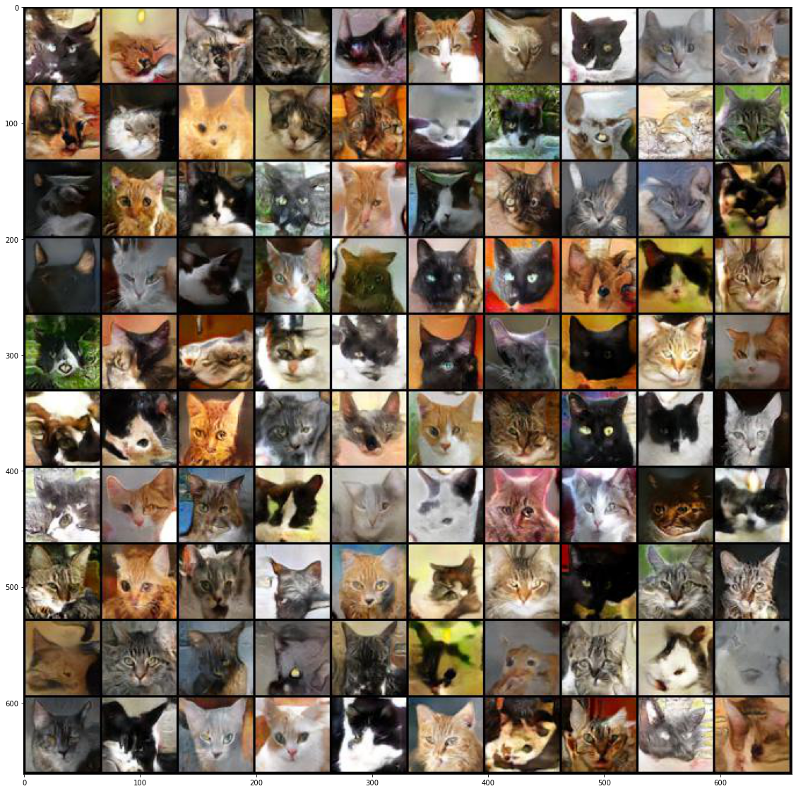
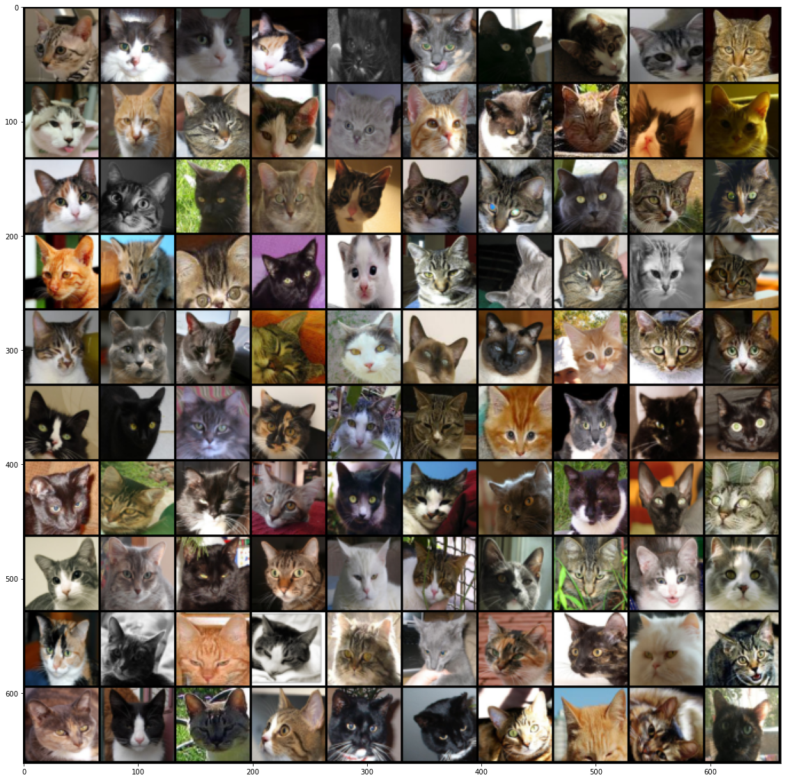

# gan-resnet-cat
## Purpose
This is to test whether I can generate some cat pictures based on GAN + resnet

## Raw data
The raw cat photos are from [Marek Zyla](https://github.com/zylamarek/cat-dataset), which is in turn modifeid from 

[Weiwei Zhang, Jian Sun, and Xiaoou Tang, "Cat Head Detection - How to Effectively Exploit Shape and Texture Features", Proc. of European Conf. Computer Vision, vol. 4, pp.802-816, 2008](https://www.microsoft.com/en-us/research/wp-content/uploads/2008/10/ECCV_CAT_PROC.pdf)

I did some cropping around the head, which is defined by the ear and mouth landmarks, to make the face larger. The code to do the cropping and the cropped dataset are in cropped.dir

## Sanity checks
I first check whether I can get some reasonable MNIST pictures. This is to make sure I understand the many loss functions in GAN. The model is standard DCGAN. This part is inspired by [Emilien Dupont](https://github.com/EmilienDupont/wgan-gp) and I have added the SNGAN models. To make the first few epoches converge faster, I also experimented with add "kick", which simply adds the standard deviations in the loss function. It helps a little in the MNIST dataset, but not much in the cat dataset.

This is a gif without "kick", from left to right is GAN, WGAN-GP, SNGAN, SNGAN with hinge loss.

Same as above, but with "kick", seems it helps to converge faster for the MNIST dataset.

It is interesting to see that the WGAN-GP behaves the best in this check. However, because it is not as efficient (about 30-50% slower) than SNGAN, so I will stick with SNGAN for the cat pictures for now.

## Generated cat pictures
The training set has ~10,000 pictures and has been resized to 64x64. The model and the training parameters are from Miyato et al. (2018), especially their Fig 8 and Table 4. The training takes about 1-2 min on a GPU per epoch, so takes a while to train. I have tried to make the codes as compact as possible. The main codes are the models\_resnet.py and trainer.py. Example of how to use them is in gan-resnet-cat.ipynb. The post-analysis.ipynb shows the convergence and some sampled figures. The training seems converge after 400 epoches.  I also make the lr smaller and continue the training for another 400 but is not improving that much. 

Here are some generated cat pictures

Compared with the ones in the training set

There still rooms for improvements but it is indeed able to get some good ones.

## References
Besides the works mention aboved, this exercise is also motivated by

https://speech.ee.ntu.edu.tw/~hylee/ml/2022-spring.php
https://towardsdatascience.com/demystified-wasserstein-gan-with-gradient-penalty-ba5e9b905ead
https://jonathan-hui.medium.com/gan-wasserstein-gan-wgan-gp-6a1a2aa1b490
https://github.com/pfnet-research/sngan\_projection/blob/master/updater.py
